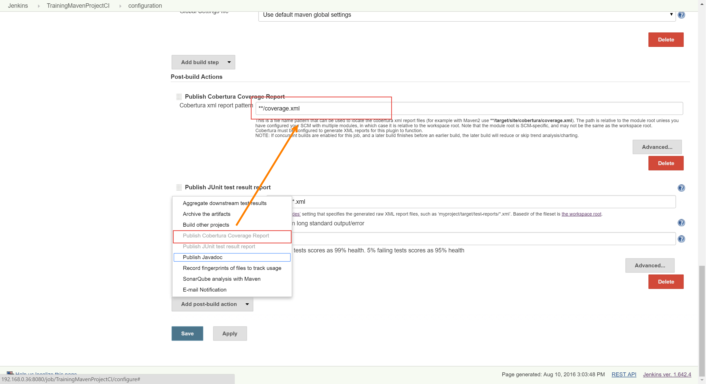
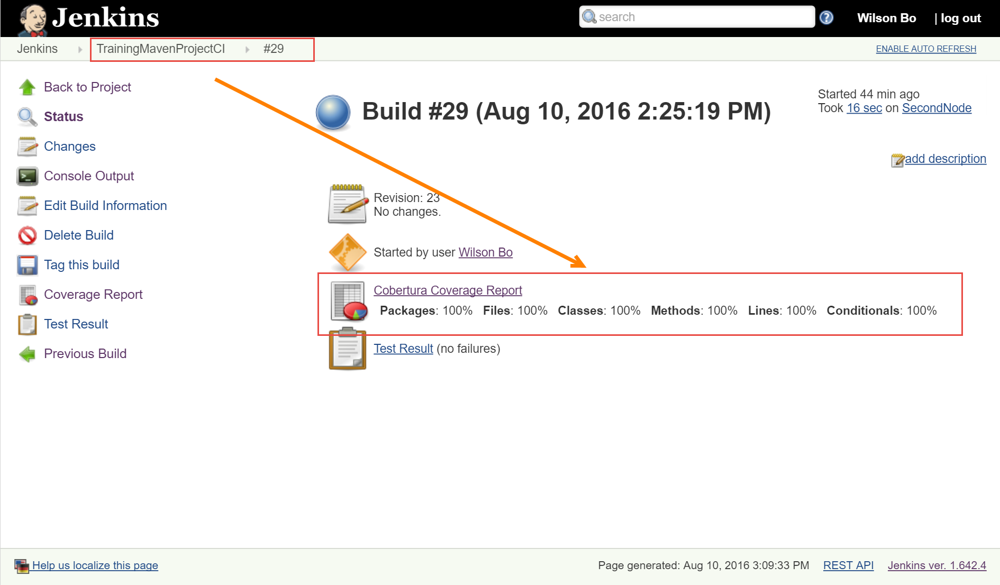
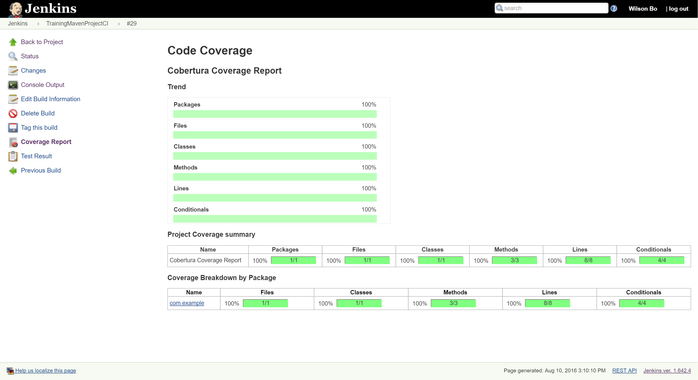
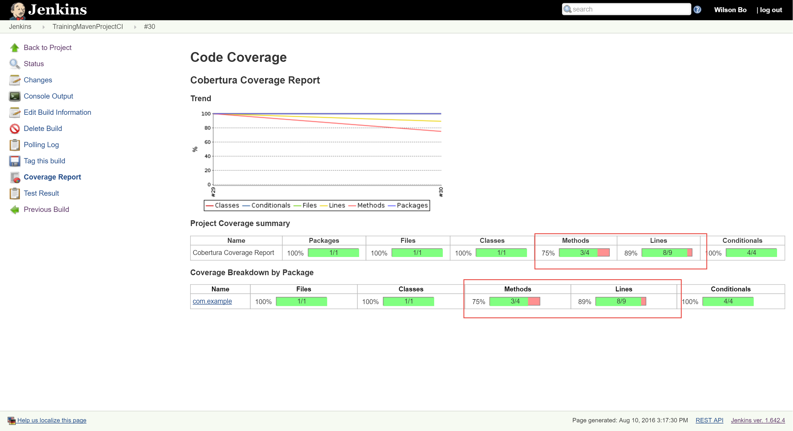

添加单元测试覆盖率计算
----------------------------------

.. attention::
    
    文档内容将与Jenkins 1.642.4保持同步，请确保你所使用的Jenkins版本与本文档的适用范围一致，再参照本文档进行Jenkins的安装和配置，以防出现联系过程中系统不对称导致的问题。
    
    本文档适用于：
    
    * Jenkins v 1.642.4

本文主要使用Cobertura计算单元测试覆盖率

修改Job配置
~~~~~~~~~~~~~~~~~~~~~~~~~~~~~~~~
添加Maven命令的Goals: cobertura:cobertura

.. figure:: images/code-coverage-maven-goals

添加post-build action， 发布Cobertura报告

运行Job，查看覆盖率结果
~~~~~~~~~~~~~~~~~~~~~~~~~~~~~~~~
安装Cobertura插件后可以在Job的运行结果页面查看Cobertura单元测试覆盖率结果

单元测试覆盖率详细结果

添加方法查看覆盖率变化
~~~~~~~~~~~~~~~~~~~~~~~~~~~~~~~~
修改文件/maven-samples-master/single-module/src/main/java/com/example/Greeter.java
在文件中加入高亮脚本，签入脚本，查看覆盖率变化。

.. code-block:: java

    package com.example;

    /**
    * This is a class.
    */
    public class Greeter {

    /**
    * This is a constructor.
    */
    public Greeter() {

    }

    //TODO: Add javadoc comment
    public String greet(String someone) {
        return String.format("Hello, %s!", someone);
    }
    
    public int calculate(String param)
    {
        if(param == "a")
            return 1;
        else if(param =="b")
            return 2;
        else
            return 0;
    }
    
    public String NotCoveredFunction(String someone) {
            return String.format("Hello, %s!", someone);
    }
    }

签入代码，然后查看单元测试覆盖率变化

