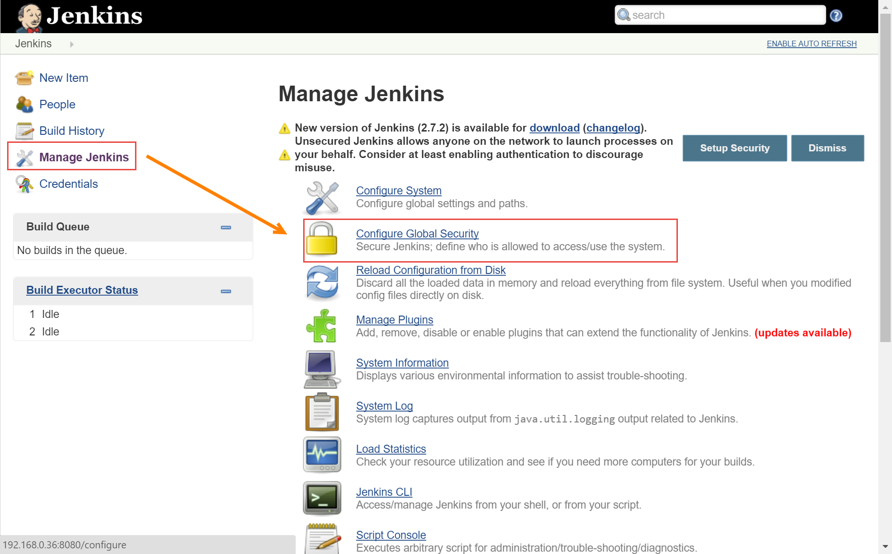

配置Jenkins权限
-----------------

.. attention::
    
    文档内容将与Jenkins 1.642.4保持同步，请确保你所使用的Jenkins版本与本文档的适用范围一致，再参照本文档进行Jenkins的安装和配置，以防出现联系过程中系统不对称导致的问题。
    
    本文档适用于：
    
    * Jenkins v 1.642.4. 
    
在Configure Global Security启动安全配置
~~~~~~~~~~~~~~~~~~~~~~~~~~~~~~~~
本次培训不在单独部署Windows AD域，所以使用Jenkins自有的数据库及project-based权限管理用户权限
(如果服务器已经启动安全设置，直接跳到6.2 注册账户)

.. figure:: config-global-security.png

注册账户
~~~~~~~~~~~~~~~~~~

现在应为匿名账户登录，在Jenkins系统右上角点击注册

.. figure:: sgin-up.png

.. figure:: project-base-matrix-security.png