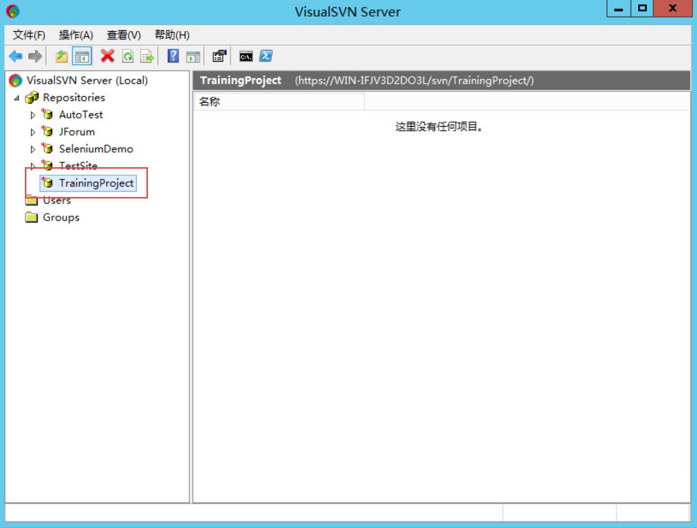
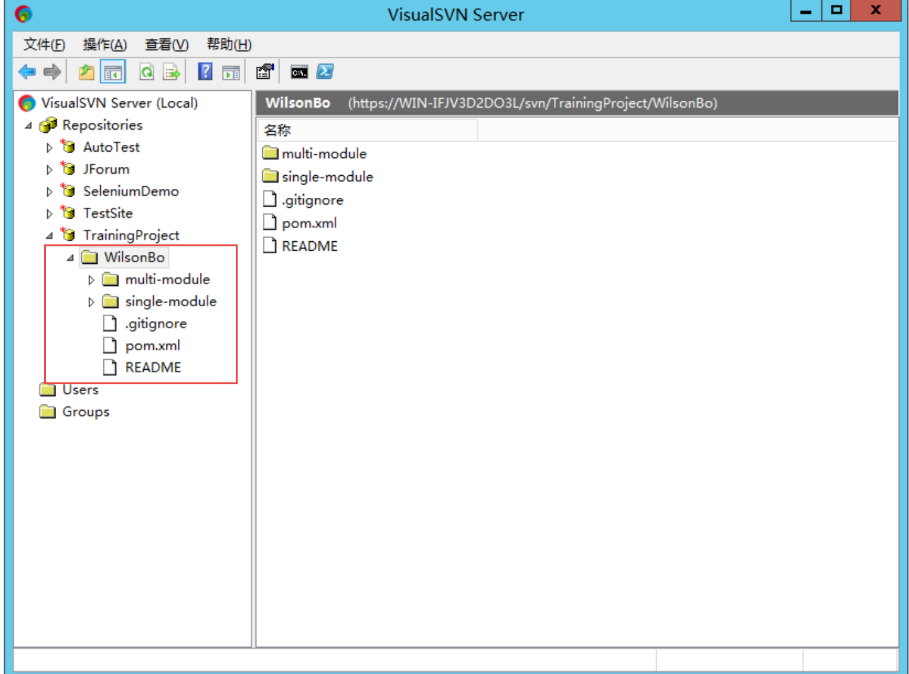
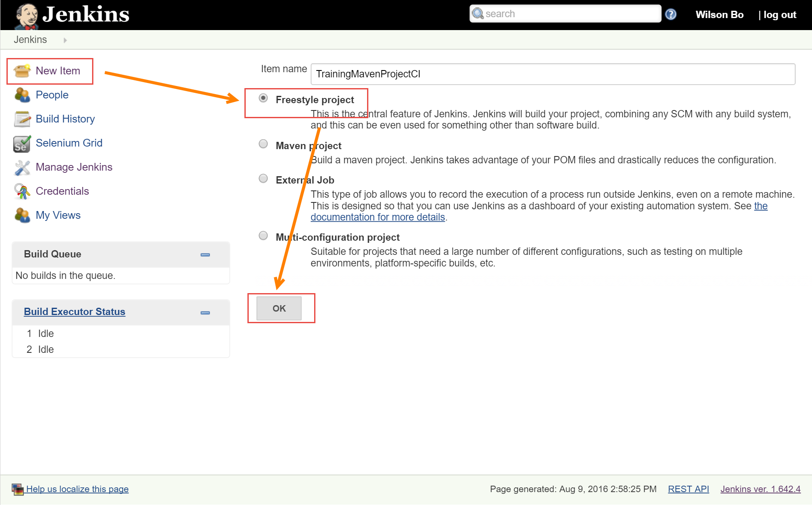
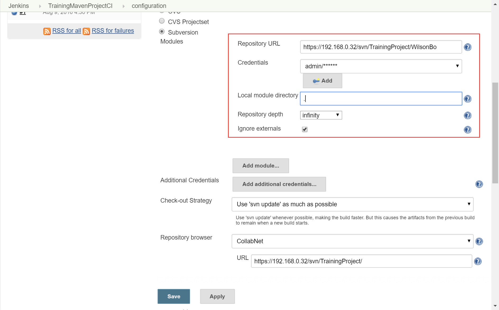
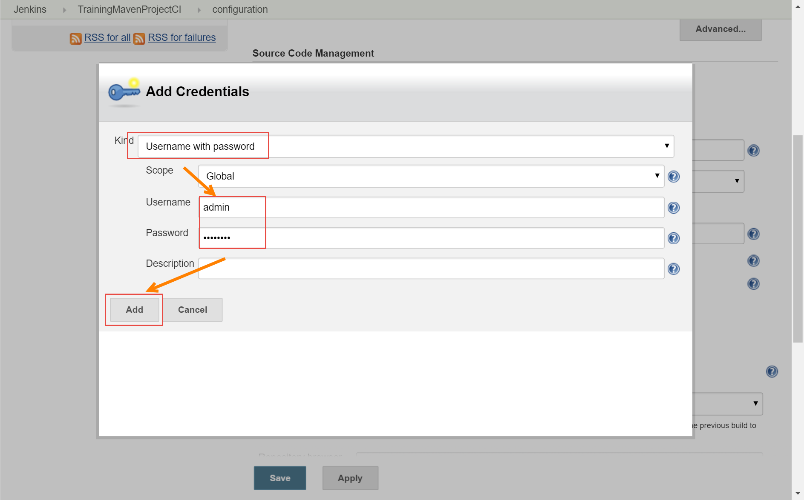
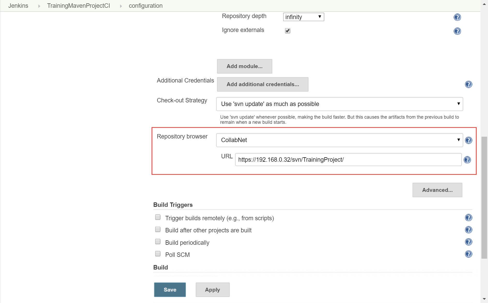
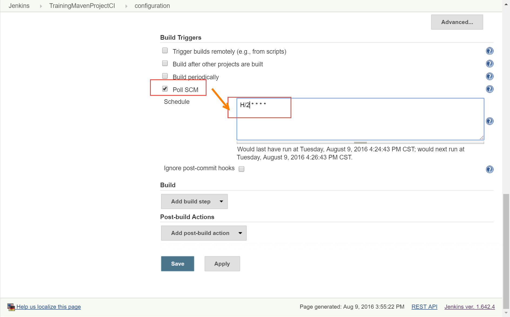
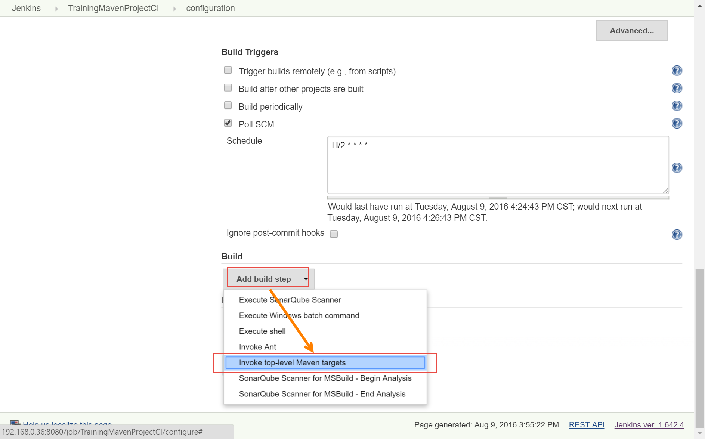
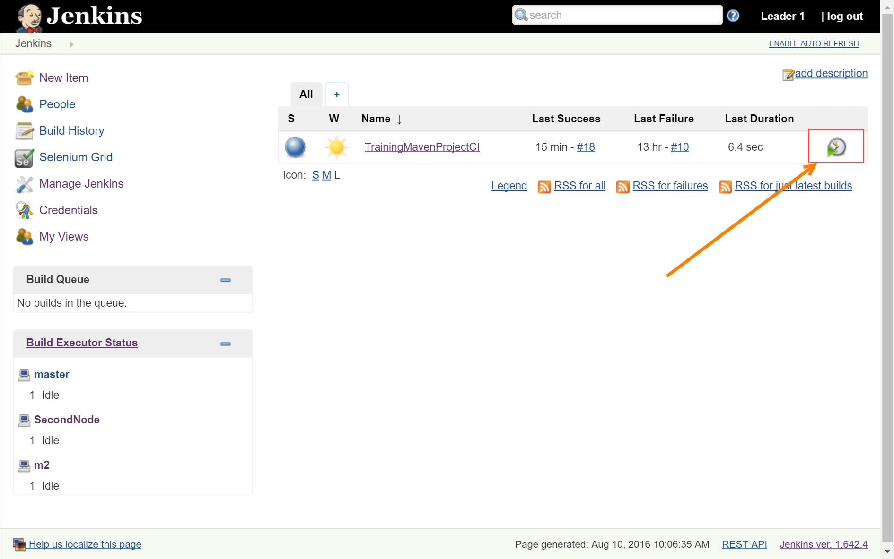

创建Jenkins Job
-----------------

.. attention::
    
    文档内容将与Jenkins 1.642.4保持同步，请确保你所使用的Jenkins版本与本文档的适用范围一致，再参照本文档进行Jenkins的安装和配置，以防出现联系过程中系统不对称导致的问题。
    
    本文档适用于：
    
    * Jenkins v 1.642.4. 

在本文档中你将学会如何创建Jenkins Job，并进行最简单的基本配置。

上传样例项目代码
~~~~~~~~~~~~~~~~~~~~~~~~~~~~~~~~~~~~~~~~~~~~~~~~~~~~~~~~~~~~~~~~
在SVN服务器上创建一个培训的Repository，Repository名称为：Training + 培训组名

.. note::

    例如：TrainingTeam1

组成员使用自己的用户名在Repository上创建自己的文件夹，

.. note::

    例如：WilsonBo

并将样例代码上传到以自己用户名命名的文件夹下（**样例项目从培训讲师处获得**）
上传后代码展示样式如下：

创建Job
~~~~~~~~~~~~~~~~~~~~~~~~~~~~~~~~~~~
Job名称使用: 成员名 + MavenProjectCI

.. note::

    例如：WilsonBoMavenProjectCI

配置Source Control Management
~~~~~~~~~~~~~~~~~~~~~~~~~~~~~~~~~~~

将SVN服务器自己所属团队的Repository下的自己的用户名文件夹的地址拷贝到 SVN设置的 Repository URL中，注意URL可以在Repository下的子目录中。

在Credentials中点击Add按钮添加Credential，可以按照用户连接SVN方式添加Credential。

.. note::

    培训环境使用用户名密码形式连接SVN服务器
    

Repository browser中选择SVN服务器类型， 并将Repository地址复制到Repository browser文本框中，这样在Job运行记录中的变更中的svn提交版本号会自带超链接，点击可以直接跳转到svn相应提交。

配置Build Triggers
~~~~~~~~~~~~~~~~~~~~~~

触发器一般使用poll SCM。 不推荐在持续集成中使用Build periodically（定时构建）
poll SCM 定时会去SCM中获取提交，如果在SCM中存在没有构建的新提交，将触发当前Job运行。

定时设置分为5部分格式为：

.. code-block:: text

    * * * * *

5个星号分别代表：分钟（0 - 59）、小时（0 - 23）、天（1 - 31）、月（1 - 12），星期 （0 - 7） 0和7均代表周日

.. note::

    15分钟
    H/15 * * * *
    # every ten minutes in the first half of every hour (three times, perhaps at :04, :14, :24)
    H(0-29)/10 * * * *
    # once every two hours every weekday (perhaps at 10:38 AM, 12:38 PM, 2:38 PM, 4:38 PM)
    H 9-16/2 * * 1-5
    # once a day on the 1st and 15th of every month except December
    H H 1,15 1-11 *

当前Job设置

配置Maven
~~~~~~~~~~~~~~
添加Maven的构建步骤，并选择在**Jenkins -> Config System**中的Maven设置

选择在Jenkins中配置的Maven。配置**Goals: clean package**，构建 java时的Maven运行命令将为：**mvn clean package**

.. figure:: images/job-maven-config.png

运行Job，并查看结果
~~~~~~~~~~~~~~~~~~~~~~~~~~~~
在Jenkins首页触发Job运行， 选择**Build Now**

.. note::

    之前所有对于SVN的Repository的操作也会触发Jenkins构建，因此注意查看最后一次提交触发的生成。
