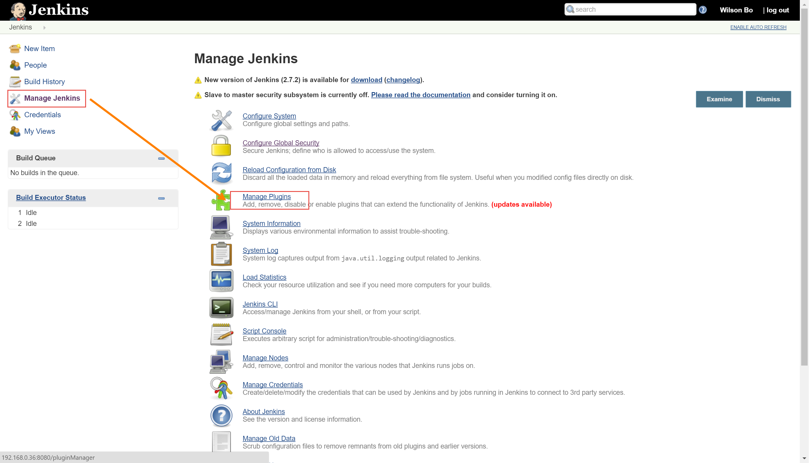
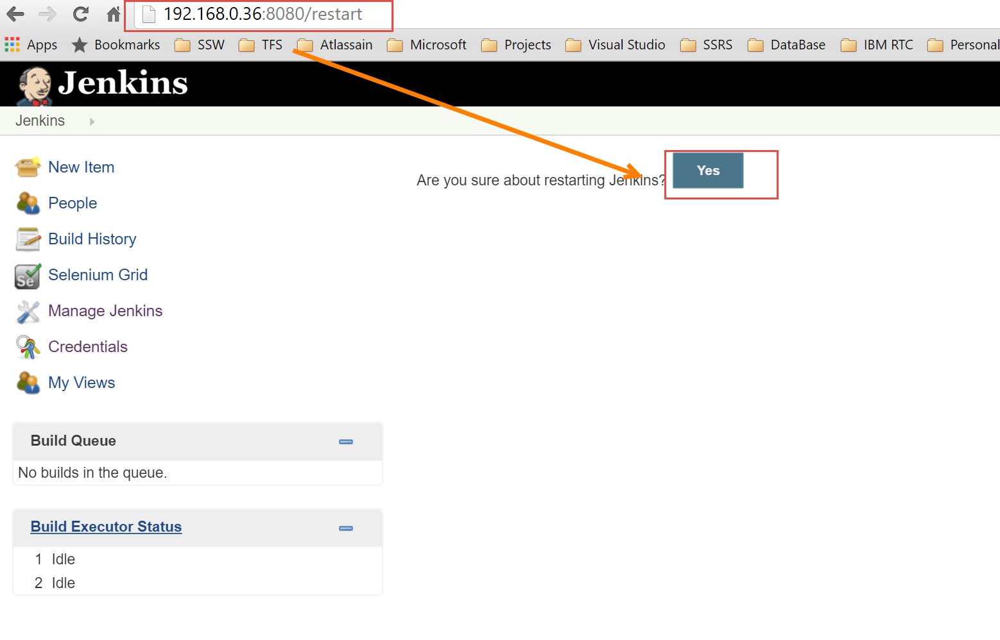

安装Jenkins插件
-----------------

.. attention::
    
    文档内容将与Jenkins 1.642.4保持同步，请确保你所使用的Jenkins版本与本文档的适用范围一致，再参照本文档进行Jenkins的安装和配置，以防出现联系过程中系统不对称导致的问题。
    
    本文档适用于：
    
    * Jenkins v 1.642.4

请检查已经安装的插件，如果不是最新版本请更新插件。（请在讲师处获取需要安装的插件安装包）

按照如下插件列表顺序安装：
* Test-result-analyzer.hpi
* Cobertura.hpi
* Jquery.hpi
* Sonar.hpi
* Selenium.hpi
* token-macro.hpi
* Nodelabelparameter.hpi
* structs.hpi
* workflow-step-api.hpi
* workflow-scm-step.hpi
* scm-api.hpi
* mapdb-api
* subversion.hpi
* dashboard-view.hpi
* project-health-report.hpi
* jira.hpi
* jenkins-jira-issue-updater.hpi
* build-pipeline-plugin.hpi
* promoted-builds.hpi
* analusis-core.hpi
* git.hpi
* parameterized-trigger.hpi
* delivery-pipeline-plugin.hpi

安装完成后再浏览器中输入http://JenkinsServer/restart 重启Jenkins

