Jenkins 运行自动化测试
----------------------------------

.. attention::
    
    文档内容将与Jenkins 1.642.4保持同步，请确保你所使用的Jenkins版本与本文档的适用范围一致，再参照本文档进行Jenkins的安装和配置，以防出现联系过程中系统不对称导致的问题。
    
    本文档适用于：
    
    * Jenkins v 1.642.4
    
检查SecondNode是否正常运行
~~~~~~~~~~~~~~~~~~~~~~~~~~~~~~~~

如果SecondNode没有正常运行，请按照 ::doc:`../day1/run-other-node` 重新配置

配置Selenium Grid
~~~~~~~~~~~~~~~~~~~~~~~~~~~~~~~~

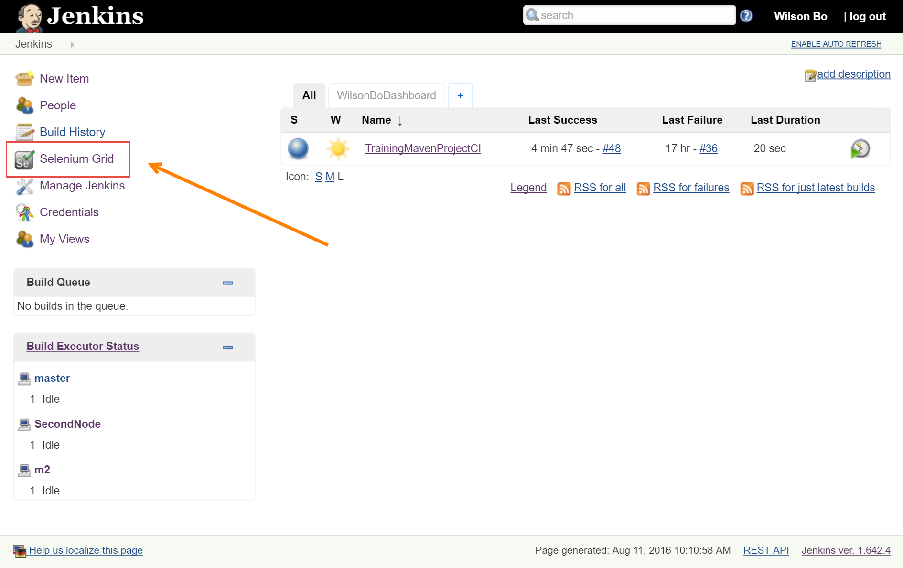

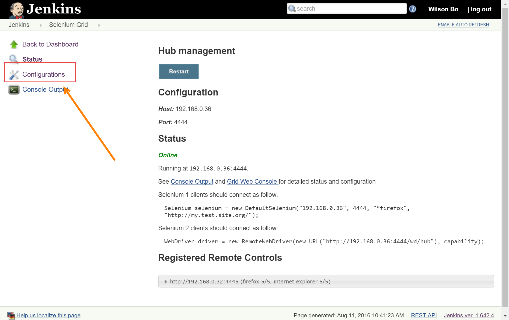

新建配置，并在配置Match nodes from a label expression中使用SecondNode节点的Label设置

.. figure:: images/jenkins-selenium-config-label.png

添加浏览器，IE与Chrome浏览器需要制定driver，（driver可以在讲师处获取）

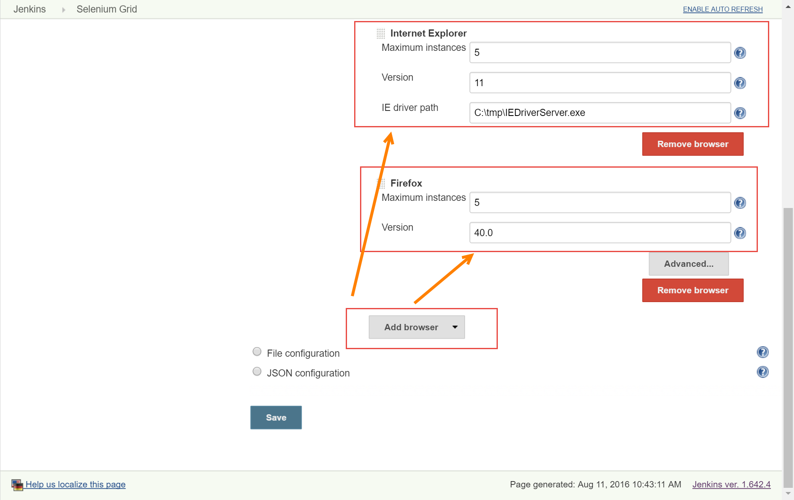

保存配置，在节点上运行配置

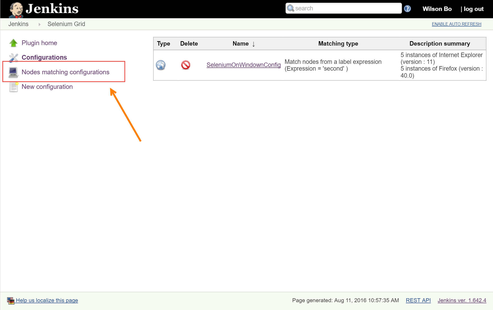

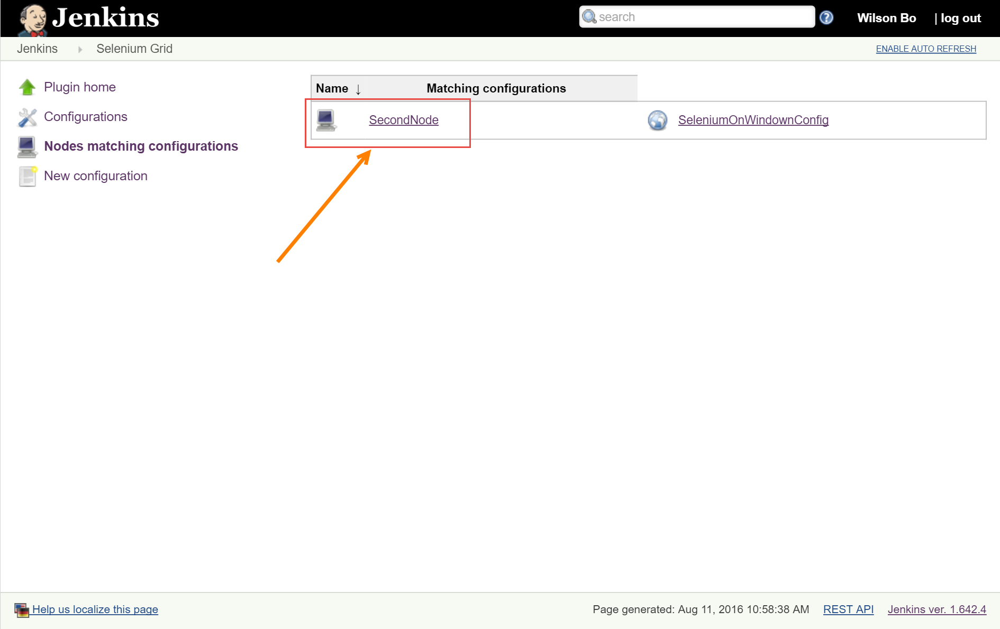

如果配置未自动运行，在下图标记出点击开始按钮

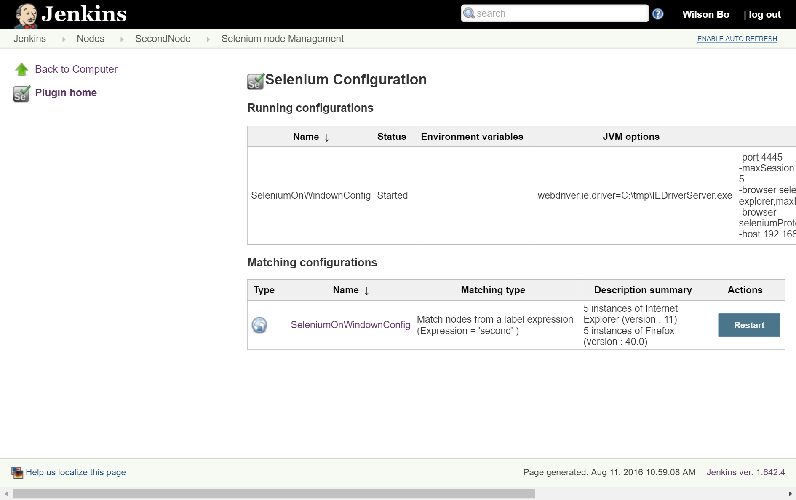

上传自动化测试项目
~~~~~~~~~~~~~~~~~~~~~~~~~~~~~~~~
在SVN中自己团队的Repository下再次创建文件夹，文件夹名称为：用户名+AutoTest
(上传的源码可在讲师处获取)
上传后目录结构应类似于：

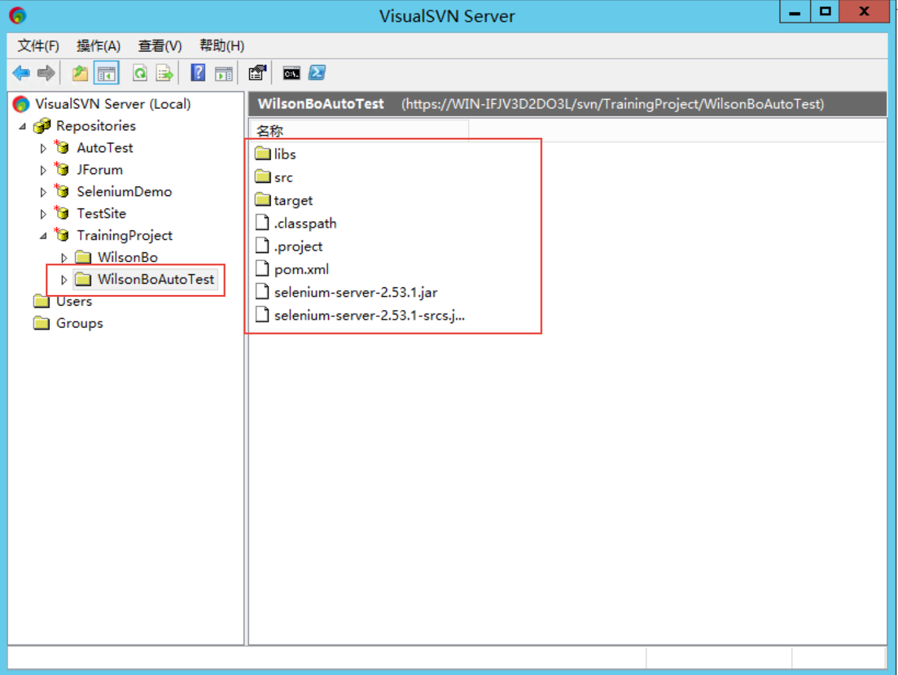

打开文件/WilsonBoAutoTest/src/test/java/com/sample/AutoTest.java
使用Selenium Grid界面的代码

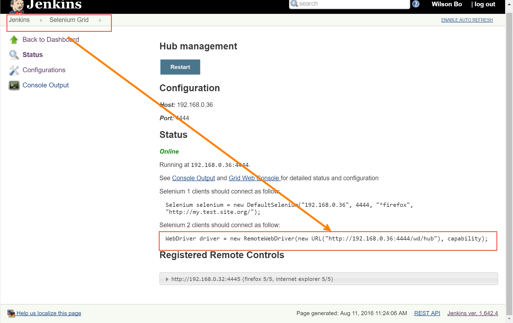

替换如下代码：

.. code-block:: java

    driver = new RemoteWebDriver(new URL("http://192.168.0.36:4444/wd/hub"), capability);

在Eclipse中运行单元测试，可以在SecondNode节点服务器的远程桌面中观察到测试的自动化运行。

创建第二个Job，运行自动化测试
~~~~~~~~~~~~~~~~~~~~~~~~~~~~~~~~
创建与第一个Job相同类型的Job，只运行自动化测试项目，项目名称为：用户名 + CD
配置SCM，路径为SVN服务器中团队Repository的 **用户名 + AutoTest** 文件夹

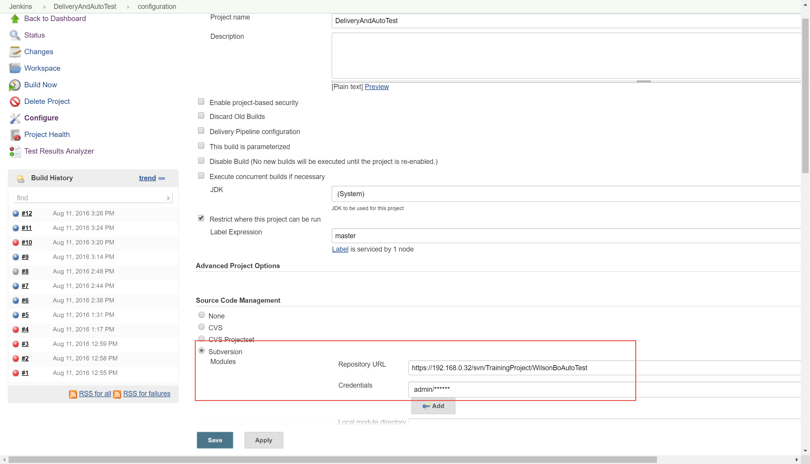

不设置触发方式， 添加Maven生成任务，和发布Junit报告任务

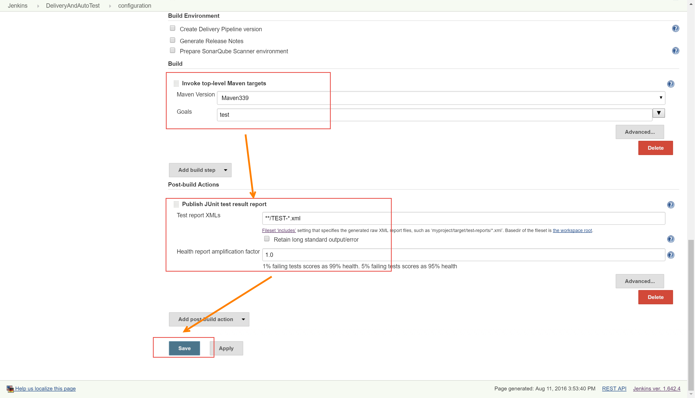

手动触发Job， SecondNode服务器上会执行有自动化测试

修改第CI Job
~~~~~~~~~~~~~~~~~~~~~~~~~~~~~~~~
现在要模拟CI+CD场景
配置第CI Job，添加结果发布任务

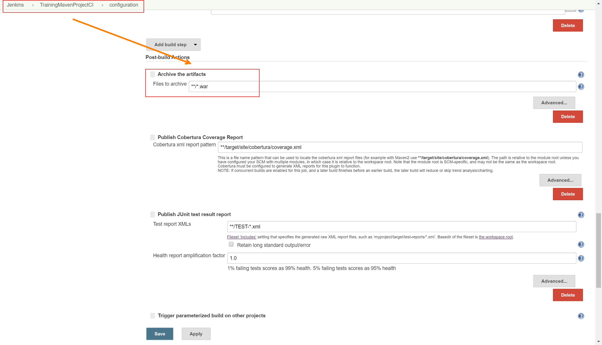

添加触发其他项目构建任务

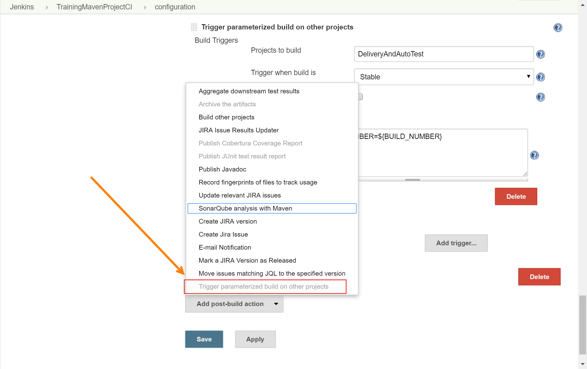

添加触发器，并设置要传递的参数

.. figure:: images/jenkins-selenium-ci-job-pass-param.png

在Parameters文本框中输入

.. code-block:: java

    PRE_BUILD_NUMBER=${BUILD_NUMBER}

参数PRE_BUILD_NUMBER可以将传递到触发的下游的CD Job中

修改CD Job
~~~~~~~~~~~~~~~~~~~~~~~~~~~~~~~~
使用第一个项目传递的构建编号，下载war文件，并部署到staging环境

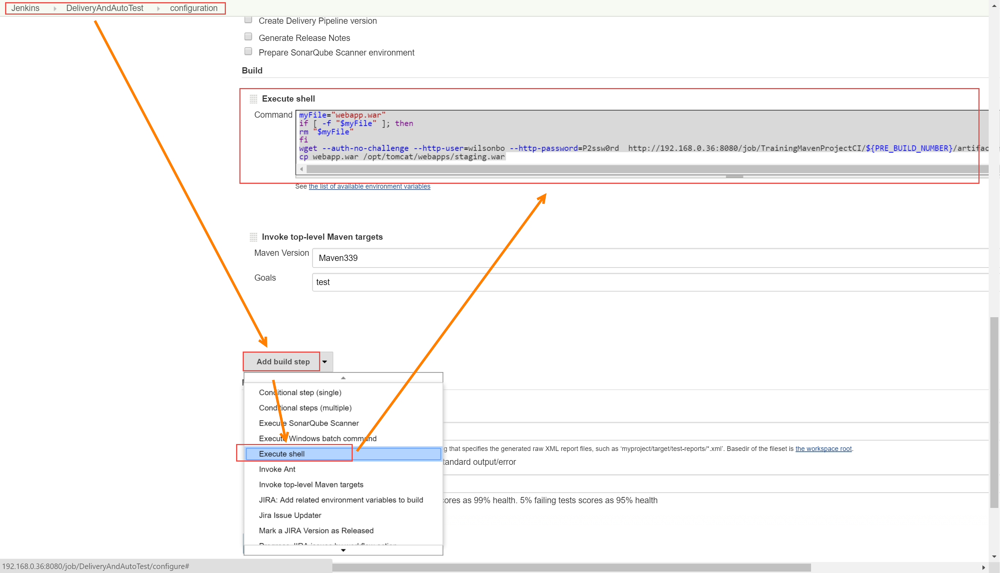

脚本为

.. code-block:: shell

    myFile="webapp.war" 
    if [ -f "$myFile" ]; then 
    rm "$myFile" 
    fi 
    wget --auth-no-challenge --http-user=wilsonbo --http-password=P2ssw0rd  http://192.168.0.36:8080/job/TrainingMavenProjectCI/${PRE_BUILD_NUMBER}/artifact/multi-module/webapp/target/webapp.war
    cp webapp.war /opt/tomcat/webapps/staging.war

修改sample项目
~~~~~~~~~~~~~~~~~~~~~~~~~~~~~~~~
修改页面/ maven-samples-master/multi-module/webapp/src/main/webapp/index.jsp计算逻辑，签入变更，查看测试结果

.. code-block:: html

    <html>
        <head>
        </head>
        <body>
            <table>
                <tr><td><input type="text" id="val1"/></td></tr>
                <tr><td><input type="text" id="val2"/></td></tr>
                <tr><td><input type="button" id="btn" onclick="calculate()" value="Calculate"/></td></tr>
                <tr><td><input type="text"  id="res"/></td></tr> 
            </table>
            
        </body>

    </html>
    

此时会先触发CI Job，当CI Job执行完成后会触发CD Job，运行结果为：

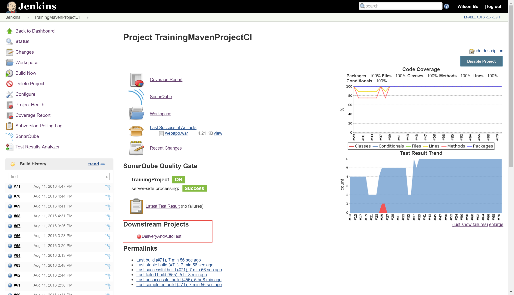

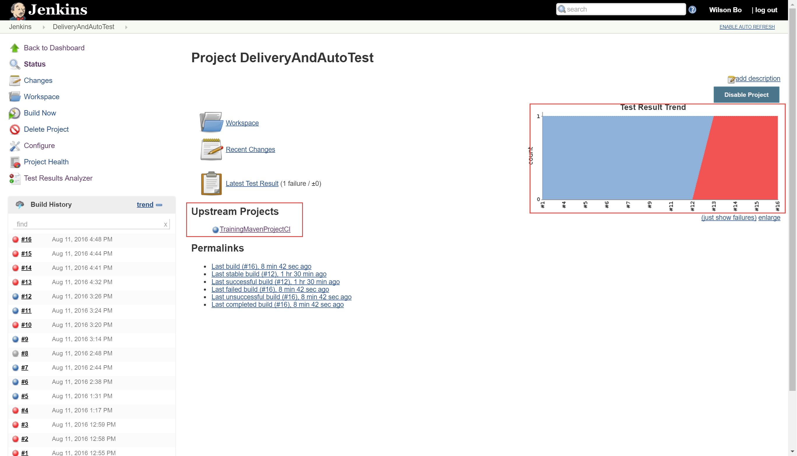

修改测试用例
~~~~~~~~~~~~~~~~~~~~~~~~~~~~~~~~
修改测试用例文件/WilsonBoAutoTest/src/test/java/com/sample/AutoTest.java，文本为

.. code-block:: java

    package test.java.com.sample;

    import java.net.MalformedURLException;
    import java.net.URL;
    import junit.framework.TestCase;
    import static org.junit.Assert.*;
    import org.junit.Test;
    import org.openqa.selenium.By;
    import org.openqa.selenium.Keys;
    import org.openqa.selenium.WebDriver;
    import org.openqa.selenium.WebElement;
    import org.openqa.selenium.firefox.*;
    import org.openqa.selenium.remote.DesiredCapabilities;
    import org.openqa.selenium.remote.RemoteWebDriver;

    public class AutoTest {

        @Test
        public void test() {
            DesiredCapabilities capability = new DesiredCapabilities();
            capability = DesiredCapabilities.internetExplorer();
            WebDriver driver = null;
            try {
                driver = new RemoteWebDriver(new URL("http://192.168.0.36:4444/wd/hub"), capability);
            } catch (MalformedURLException e) {
                // TODO Auto-generated catch block
                e.printStackTrace();
            }
            driver.manage().window().maximize();
                driver.get("http://192.168.0.36:8080/staging/");
                
                
                
                WebElement txtVal1 = driver.findElement(By.id("val1"));
                WebElement txtVal2 = driver.findElement(By.id("val2"));
                
                WebElement btn = driver.findElement(By.id("btn"));
                
                
                
                txtVal1.sendKeys(new String[]{"1"});
                txtVal2.sendKeys(new String[]{"2"});
                
                btn.click();
                
                WebElement res = driver.findElement(By.id("res"));
            String v = res.getAttribute("value");
            assertEquals(v, "-1");
                
                driver.close();
        }
    }

签入源代码，手动运行CI Job。

创建Delivery Pipeline视图
~~~~~~~~~~~~~~~~~~~~~~~~~~~~~~~~
与创建仪表板视图一样，创建发布管道视图，视图名称： 用户名+CD

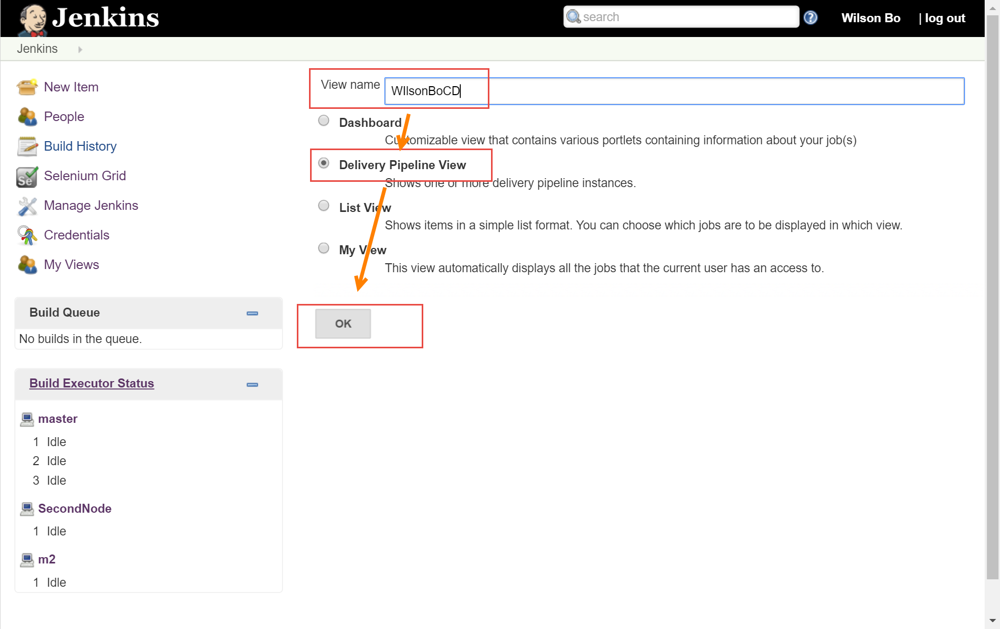

在视图配置页面最下方，添加管道，并在initial job中设置第一个创建的Job，下面的final job中创建第二个创建的Job
保存修改查看视图

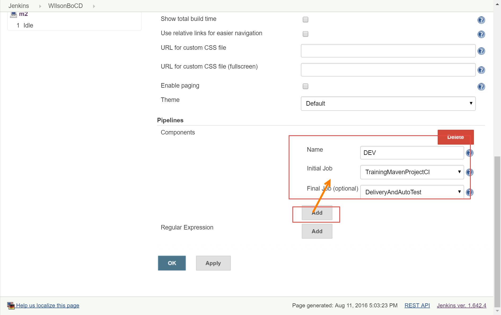

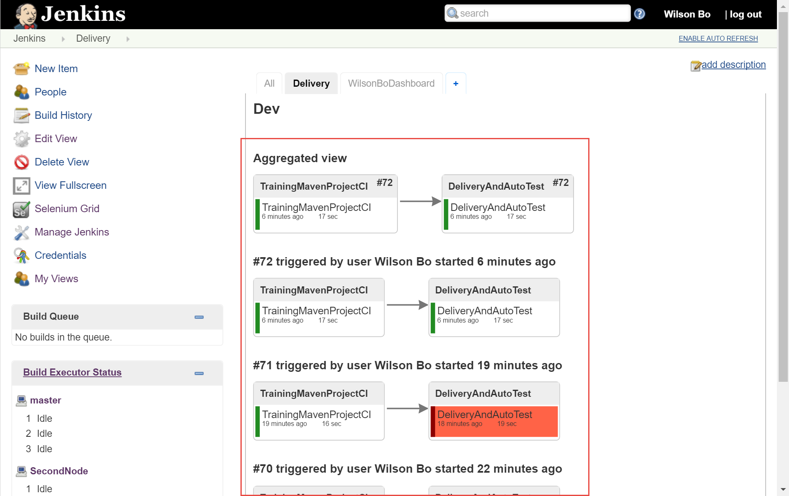

