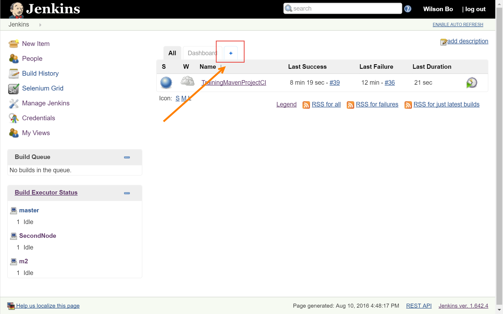
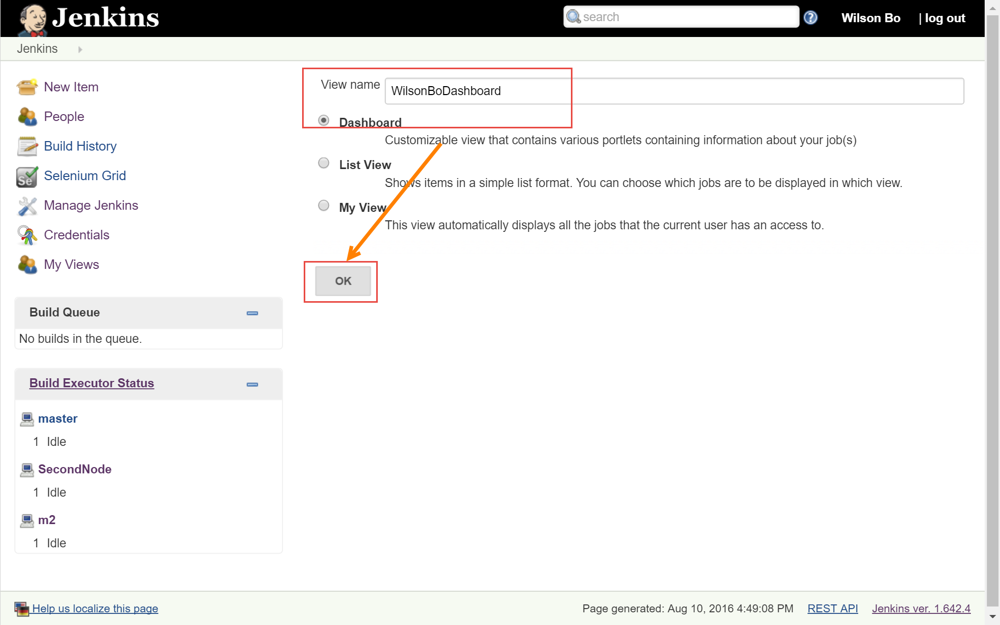
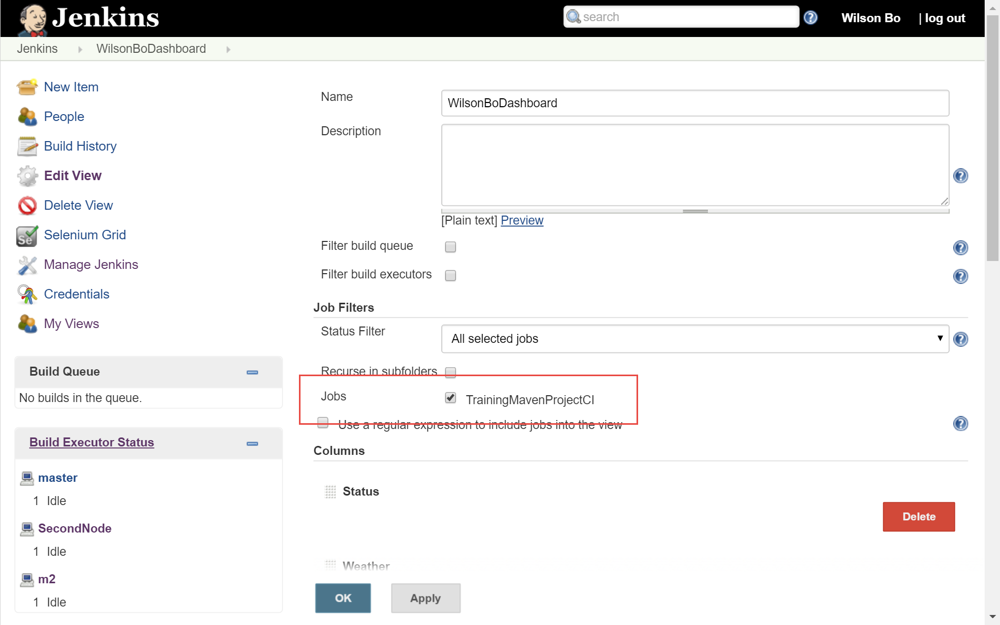
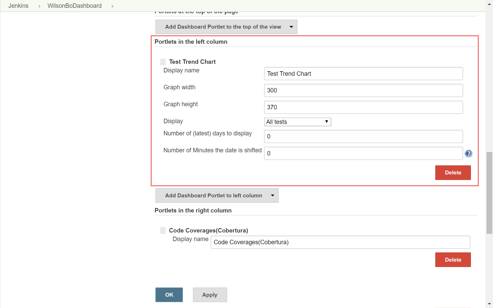
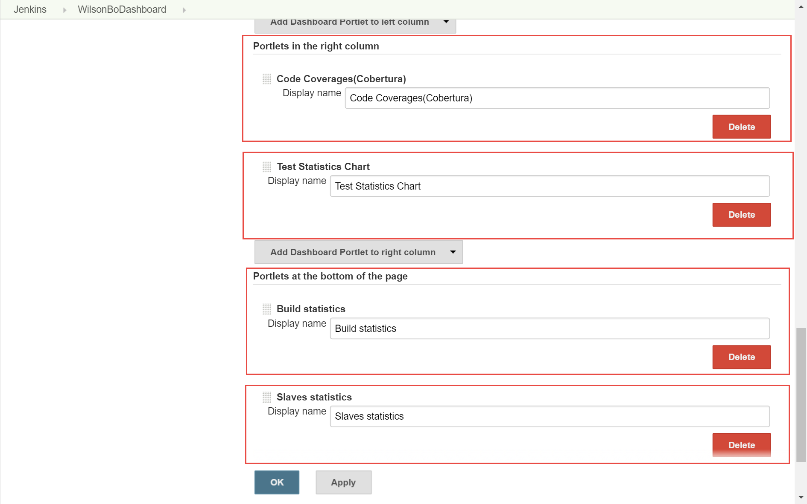
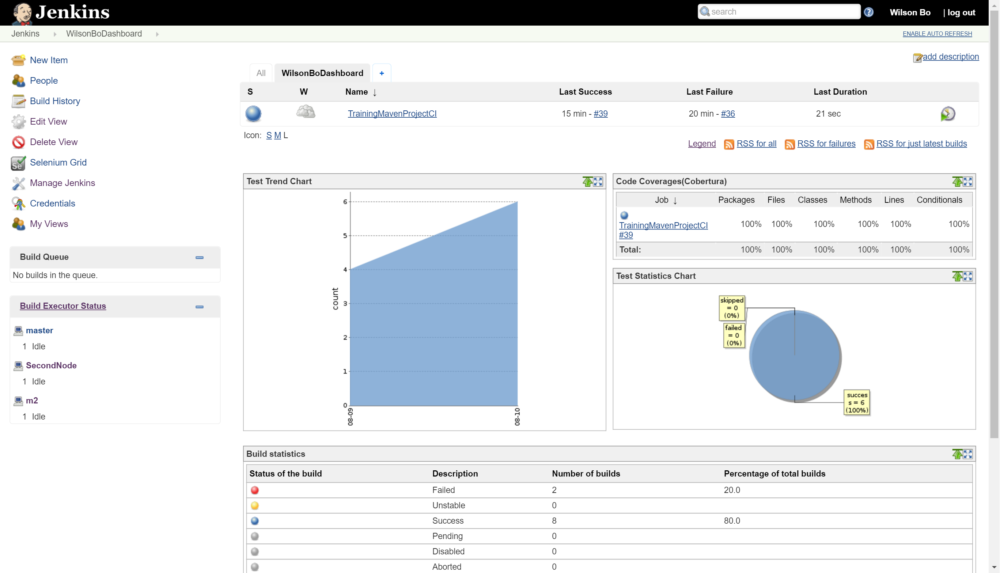

添加自动化测试
----------------------------------

.. attention::
    
    文档内容将与Jenkins 1.642.4保持同步，请确保你所使用的Jenkins版本与本文档的适用范围一致，再参照本文档进行Jenkins的安装和配置，以防出现联系过程中系统不对称导致的问题。
    
    本文档适用于：
    
    * Jenkins v 1.642.4
    
添加Job视图

视图名称：用户名 + Dashboard

勾选自己创建的Job

按照下图配置，分别创建5个模块

保存视图，查看结果

